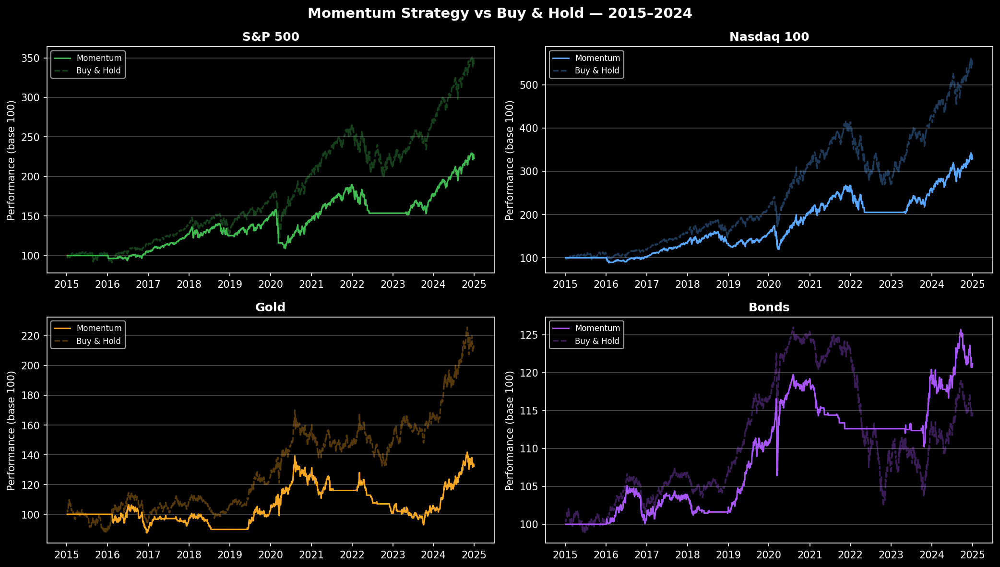
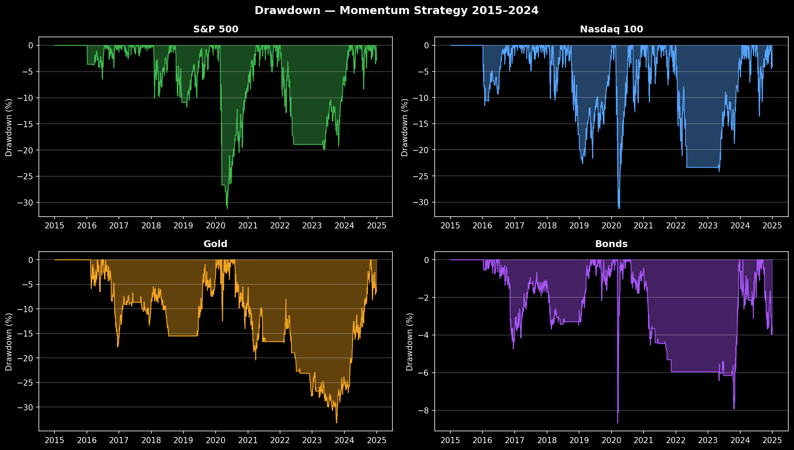
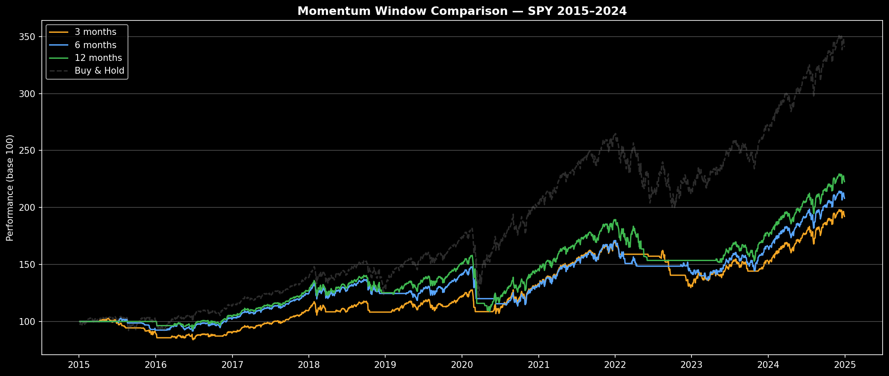

# Momentum Strategy Backtest — Multi-Asset (2015–2024)

Backtest of a 12-month momentum strategy across 4 asset classes.
Signal: go long if the 12-month return is positive, stay in cash otherwise.

## Results

### Multi-Asset Performance
| Asset | Strategy | Buy & Hold | Sharpe | Max Drawdown | In Market |
|---|---|---|---|---|---|
| S&P 500 (SPY) | 8.4% | 13.3% | 0.53 | -31.2% | 75% |
| Nasdaq 100 (QQQ) | 12.7% | 18.6% | 0.64 | -31.2% | 76% |
| Gold (GLD) | 2.9% | 7.6% | 0.13 | -33.3% | 62% |
| Bonds (BND) | 1.9% | 1.4% | 0.00 | -8.7% | 57% |

### Momentum Window Comparison — SPY
| Window | Ann. Return | Sharpe | Max Drawdown | In Market |
|---|---|---|---|---|
| 3 months | 6.8% | 0.46 | -23.7% | 74% |
| 6 months | 7.6% | 0.51 | -23.3% | 75% |
| 12 months | 8.4% | 0.53 | -31.2% | 75% |

## Charts

## Key Findings

- Momentum works best on **equities** (QQQ: 12.7% annualized) vs commodities or bonds
- Bonds (BND) is the only asset where the strategy **beats Buy & Hold** (1.9% vs 1.4%)
- Longer lookback windows (12M) maximize returns but increase drawdown vs shorter windows (3M: -23.7%)
- The strategy is in cash 25-38% of the time, providing meaningful downside protection

## Analysis & Conclusion

The momentum strategy does not outperform Buy & Hold on raw returns — and that is
an honest, expected result consistent with academic literature post-2010.

However, raw return is not the right metric to judge a momentum strategy.
Its value lies in **drawdown reduction**: by moving to cash during bearish periods,
the strategy avoids the worst of market selloffs. This matters in practice because
institutional investors and fund managers cannot afford to show clients -33% drawdowns
— capital outflows and panic selling often do more damage than the drawdown itself.

**What this strategy does well:**
- Reduces max drawdown on SPY (-31.2% vs -33.7% Buy & Hold)
- Dramatically limits drawdown on Bonds (-8.7%)
- Provides a systematic, rules-based framework with no discretionary bias

**What it does not do:**
- It does not generate alpha over a long bull market (2015–2024 was strongly bullish)
- It sacrifices upside by staying in cash during momentum reversals

**How to improve it:**
- Combine with a volatility filter (reduce position size when VIX is elevated)
- Add a macro trend signal (e.g. 200-day moving average filter)
- Apply cross-sectional momentum: rotate into the best performing asset each month

## Approach

- **Data**: Adjusted closing prices via `yfinance` (2015–2024)
- **Signal**: N-day momentum — long if positive, cash otherwise
- **Look-ahead bias prevention**: signal shifted by 1 day (`shift(1)`)
- **Assets**: SPY, QQQ, GLD, BND

## Stack

Python · pandas · numpy · matplotlib · yfinance · Jupyter

## Run it

pip install pandas numpy matplotlib yfinance jupyter
jupyter notebook momentum_backtest.ipynb